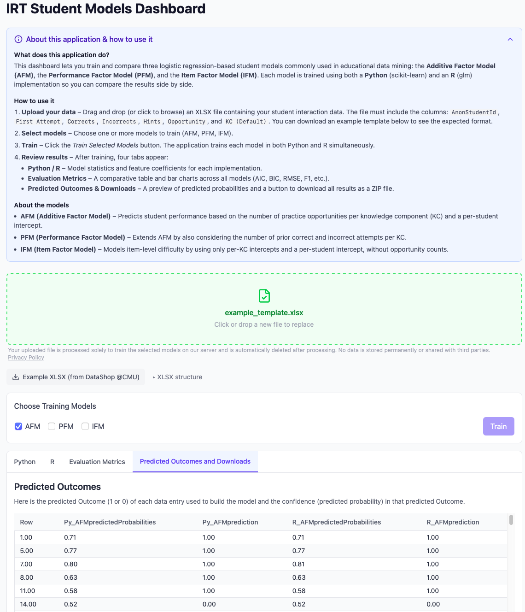

# Student Model Dashboard

Web-based platform for training **Item-Response Theory (IRT)** student models. Train models in both Python and R, compare results, and export evaluation statistics — all without any programming knowledge. GDPR compliant.



## Supported Models

| Model | Full Name | Paper |
|-------|-----------|-------|
| **AFM** | Additive Factor Model | [Cen, Koedinger & Junker (2006)](https://doi.org/10.1007/11774303_17) |
| **PFM** | Performance Factor Model | [Pavlik, Cen & Koedinger (2009)](https://dl.acm.org/doi/10.5555/1659450.1659529) |
| **IFM** | Instructional Factor Model | [Chi, Koedinger, Gordon, Jordan & VanLehn (2011)](https://www.cs.cmu.edu/~ggordon/chi-etal-ifa.pdf) |

Each model can be trained in both Python (scikit-learn / patsy) and R (glm / DAAG), allowing side-by-side comparison of implementations.

## Architecture

The application runs as three Docker containers:

| Service | Tech | Description |
|---------|------|-------------|
| **Frontend** | React, TypeScript, Vite, Tailwind CSS | Upload data, configure models, view results |
| **Python Backend** | FastAPI, scikit-learn, patsy | Trains all Python-based IRT models in a single request |
| **R Backend** | Plumber, glm, DAAG | Trains R-based IRT models (one model per request) |

The frontend is served via **nginx**, which also reverse-proxies API requests to the backends. All processing happens in-browser or server-side — no data leaves the deployment.

## Requirements

- [Docker](https://docs.docker.com/get-docker/) installed and running

## Local Development

1. Clone this repository
2. Start the services:
```bash
docker compose up -d
```
3. Open [http://localhost:3000](http://localhost:3000)

## Production Deployment

The production setup expects an **external nginx reverse proxy** (e.g. Nginx Proxy Manager) that routes traffic to the application. The frontend and backends are accessible at:

- `/studentmodelsdashboard` — frontend
- `/studentmodelsdashboardbackendpython/` — Python API
- `/studentmodelsdashboardbackendrscript` — R API

Steps:

1. Clone this repository
2. Create the shared proxy network:
```bash
docker network create nginx-proxy
```
3. Start the services:
```bash
docker compose -f docker-compose.prod.yml up -d
```
4. Configure the above routes on your reverse proxy
5. Ensure SSL terminates before reaching the application
